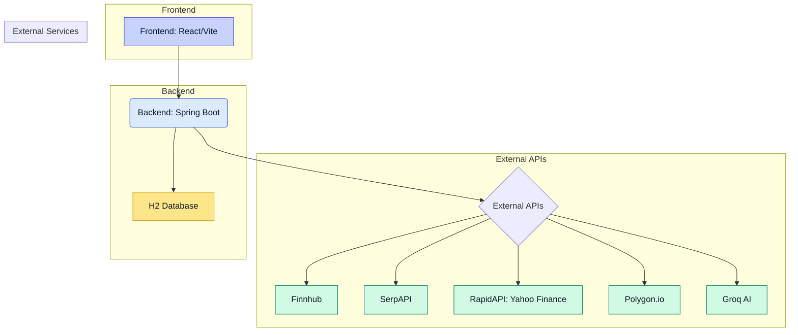
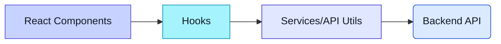
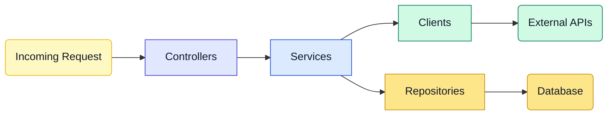

# BörsVy Stock Analysis Platform

A comprehensive web-based stock analysis platform built with React, Spring Boot, and multiple financial APIs, featuring AI-powered analysis and sentiment detection. The platform provides real-time data visualization, technical analysis, news sentiment analysis, and personalized watchlists.

## Key Features

- **Real-time Stock Data**: Live price updates and historical charts with multiple timeframes
- **AI-Powered Analysis**: Stock analysis summaries generated by advanced LLM models
- **Advanced Sentiment Analysis**: Multi-layered sentiment detection for news articles with confidence scoring
- **Technical Indicators**: Visualization of key technical indicators for informed trading decisions
- **Industry Comparison**: Compare stocks with industry peers across key metrics
- **Personalized Watchlists**: Save favorite stocks for quick access
- **Responsive Design**: Fully functional across desktop and mobile devices
- **Dark/Light Mode**: User-customizable interface theme

## Project Architecture

### System Overview

*   **Frontend:** A modern React application built with Vite, using Ant Design and Tailwind CSS for the UI. It interacts with the backend API.
*   **Backend:** A robust Spring Boot application providing a REST API. It orchestrates calls to various external financial and AI APIs and manages data persistence using an H2 database.
*   **External APIs:** The platform integrates multiple third-party services:
    *   **Finnhub:** Used for real-time stock quotes and company profile information.
    *   **SerpAPI:** The primary source for fetching news articles via Google News search.
    *   **RapidAPI (Yahoo Finance):** Serves as a fallback source for news articles when SerpAPI is unavailable.
    *   **Polygon.io:** Provides historical stock data (OHLCV) for charting and analysis.
    *   **Groq API:** Powers AI-driven analysis and sentiment detection for market data and news using the Llama-3-70B model.
*   **Database:** An embedded H2 database stores application data (e.g., user preferences, potentially cached analysis).

### Frontend Architecture (Simplified)
React components fetch data from the backend API via services/hooks and display it using UI libraries.


### Backend Architecture (Simplified)
Spring Controllers handle incoming requests, delegate business logic to Services, which in turn use Clients to interact with external APIs or Repositories to access the database.


## Features

### Stock Analysis Dashboard
[](screenshots/dashboard.png)
- Real-time stock data visualization
- Interactive charts and technical indicators
- Portfolio tracking and analysis

### News and Sentiment Analysis
[](screenshots/news-sentiment.png)
- Latest market news with sentiment analysis
- AI-powered news relevance scoring
- Sentiment distribution visualization

### Technical Analysis
[](screenshots/technical-analysis.png)
- Advanced charting tools
- Technical indicators and patterns
- Historical data analysis

### AI-Powered Insights
[](screenshots/ai-insights.png)
- Machine learning-based predictions
- Market trend analysis
- Risk assessment

## Project Structure

- **Frontend**: 
  - React with JavaScript (JSX) + Vite
  - UI: Ant Design (antd) + Tailwind CSS
  - Charts: Chart.js + Recharts
  - Routing: React Router
- **Backend**: Spring Boot 3.2.4 (Java 17) REST API
  - Manages interactions with external APIs
  - Provides data to the frontend
- **Database**: H2 Database (embedded, file-based)
- **External APIs Used**: 
  - **Finnhub API:** Real-time stock quotes, company profiles.
  - **SerpAPI:** Primary news source (Google News search).
  - **RapidAPI (Yahoo Finance):** Fallback news source.
  - **Polygon.io:** Historical stock data.
  - **Groq API:** LLM for AI analysis (`llama-3.3-70b-versatile`).
- **Deployment**: Hetzner VPS with Nginx, HTTPS/SSL via Let's Encrypt, and systemd service management.

## Prerequisites

- Node.js (v18 or higher)
- Java 17 or higher
- Docker (optional, for containerized deployment)
- API Keys (see below)

## Running the Application

### Environment Setup (.env file)

Before running the backend, create a `.env` file in the `backend` directory (`backend/.env`) with your API keys:

```dotenv
# backend/.env
FINNHUB_API_KEY=your_finnhub_api_key
SERPAPI_API_KEY=your_serpapi_api_key
POLYGON_API_KEY=your_polygon_api_key
GROQ_API_KEY=your_groq_api_key
RAPIDAPI_API_KEY=your_rapidapi_key 
# Note: The RapidAPI host is configured in application.properties, not here.
```

### Frontend

1.  Navigate to the frontend directory: `cd frontend`
2.  Install dependencies: `npm install`
3.  (Optional) Create a `.env.local` file to override the default backend URL if running locally:
    ```
    # frontend/.env.local
    VITE_API_URL=http://localhost:8080 
    ```
4.  Start the development server: `npm run dev`
    (Frontend available at http://localhost:3000 or similar)

### Backend

1.  Navigate to the backend directory: `cd backend`
2.  Ensure the `backend/.env` file is created with your API keys (see above).
3.  Build and run the application using Maven Wrapper:
    ```bash
    ./mvnw spring-boot:run 
    ```
    (Backend API available at http://localhost:8080)

## API Keys Required

To use the application with full functionality, obtain API keys from the following services and add them to the `backend/.env` file:

1.  **Finnhub:** (https://finnhub.io/) - Free tier available.
2.  **SerpAPI:** (https://serpapi.com/) - Free trial or paid plans.
3.  **Polygon.io:** (https://polygon.io/) - Free tier available for personal use.
4.  **Groq:** (https://console.groq.com/) - Create an account and generate an API key.
5.  **RapidAPI:** (https://rapidapi.com/) - Sign up and subscribe to a Yahoo Finance API (e.g., `yahoo-finance166`). Free tiers often available.

## Deployment

The application is deployed on a Hetzner VPS (Virtual Private Server) with a production-grade setup.

### Frontend Deployment
The frontend is served by Nginx as static files, with proper MIME types configured for modern JavaScript modules and CSS files.

### Backend Deployment
The backend runs as a systemd service for reliability and automatic recovery:
```bash
# View backend service status
systemctl status borsvy.service
```

The deployment includes:
- HTTPS with Let's Encrypt SSL certificates
- Cloudflare integration for security and performance
- Automatic service recovery via systemd
- Log rotation to manage disk usage
- HTTP to HTTPS redirection

### Environment Variables (for Production Deployment)

- **Frontend Service:**
    - `VITE_API_URL`: Public URL of your deployed backend service.
- **Backend Service:**
    - `PORT`: Provided by the platform (e.g., Railway sets this automatically).
    - `FINNHUB_API_KEY`: Your Finnhub API key.
    - `SERPAPI_API_KEY`: Your SerpAPI key.
    - `POLYGON_API_KEY`: Your Polygon.io API key.
    - `GROQ_API_KEY`: Your Groq API key.
    - `RAPIDAPI_API_KEY`: Your RapidAPI key for the Yahoo Finance API.

## Tags

`#StockAnalysis` `#React` `#SpringBoot` `#AI` `#SentimentAnalysis` `#TechnicalIndicators` `#FinancialAPIs` `#DataVisualization` `#DarkMode` `#ResponsiveDesign`

## Deployed Application

The application is live and accessible at: [BörsVy Stock Analysis Platform](https://your-deployed-link.com)

## License

MIT License