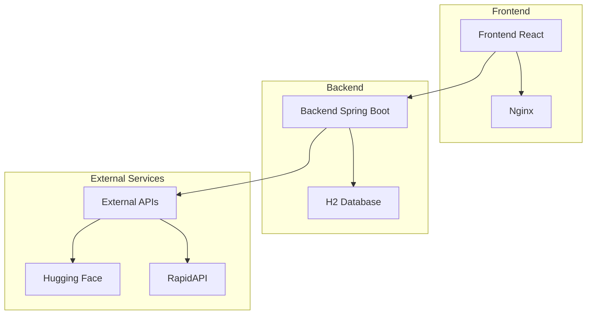
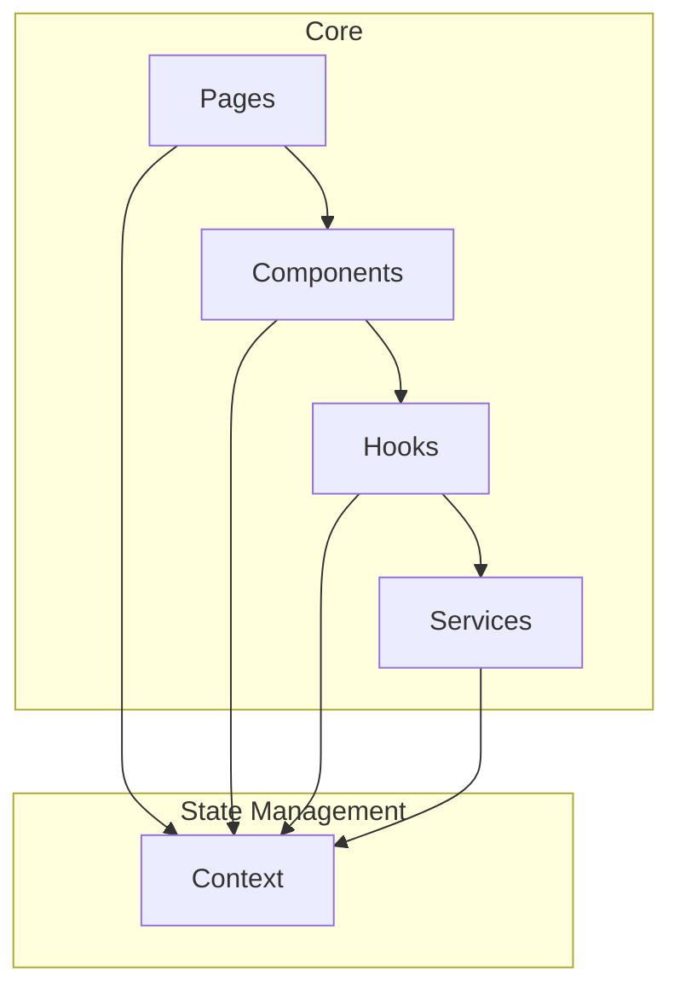
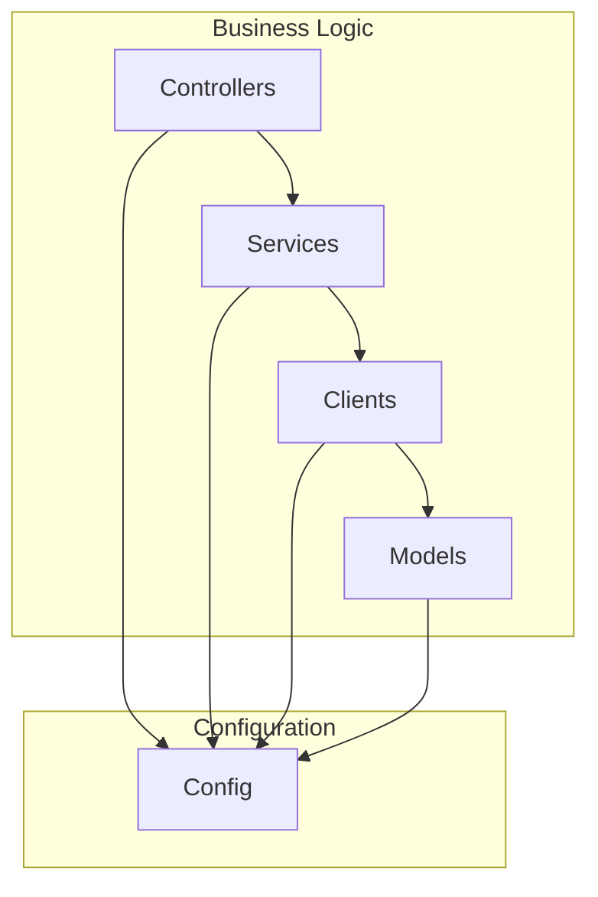

# BörsVy Stock Analysis Platform

A web-based stock analysis platform built with React, Spring Boot, and multiple financial APIs, featuring AI analysis powered by Hugging Face.

## Project Architecture

### System Overview


### Frontend Architecture


### Backend Architecture


## Features

### Stock Analysis Dashboard
[](screenshots/dashboard.png)
- Real-time stock data visualization
- Interactive charts and technical indicators
- Portfolio tracking and analysis

### News and Sentiment Analysis
[](screenshots/news-sentiment.png)
- Latest market news with sentiment analysis
- AI-powered news relevance scoring
- Sentiment distribution visualization

### Technical Analysis
[](screenshots/technical-analysis.png)
- Advanced charting tools
- Technical indicators and patterns
- Historical data analysis

### AI-Powered Insights
[](screenshots/ai-insights.png)
- Machine learning-based predictions
- Market trend analysis
- Risk assessment

## Project Structure

- **Frontend**: 
  - React with JavaScript (JSX) + Vite
  - UI: Ant Design (antd) + Tailwind CSS
  - Charts: Chart.js + Recharts
  - Routing: React Router
  - Build: Vite with optimized chunk splitting
  - Server: Nginx with gzip compression and caching
- **Backend**: Spring Boot 3.2.4 (Java 17) REST API
  - Tomcat server with optimized thread pool
  - Hikari connection pool for database connections
  - Detailed logging configuration
- **Database**: 
  - H2 Database (file-based) for both development and production
  - Persistent data storage
  - Automatic schema updates
- **External APIs**: 
  - Finnhub API for real-time stock data
  - Polygon.io for historical data
  - SerpAPI for news analysis
  - Hugging Face for AI analysis
- **Deployment**: Docker containers deployed on Railway

## Prerequisites

- Node.js (v18 or higher)
- Java 17 or higher
- Docker

## Running the Application

### Frontend

1. Navigate to the frontend directory:
```bash
cd frontend
```

2. Install dependencies:
```bash
npm install
```

3. Create a `.env` file with the following variables:
```
VITE_API_URL=https://borsvy-backend-production.up.railway.app
```

4. Start the development server:
```bash
npm run dev
```

The frontend will be available at http://localhost:3000

### Backend

1. Navigate to the backend directory:
```bash
cd backend
```

2. The H2 database is automatically configured. The application uses the following database configuration:
```properties
# Database settings
spring.datasource.url=jdbc:h2:file:./data/borsvy;DB_CLOSE_ON_EXIT=FALSE
spring.datasource.driverClassName=org.h2.Driver
spring.datasource.username=sa
spring.datasource.password=password
spring.jpa.database-platform=org.hibernate.dialect.H2Dialect
spring.jpa.hibernate.ddl-auto=update
spring.jpa.show-sql=true
spring.h2.console.enabled=false  # Disabled in production for security

# Server settings
server.port=${PORT:8080}
server.tomcat.max-threads=200
server.tomcat.min-spare-threads=20
server.tomcat.uri-encoding=UTF-8

# API Keys
finnhub.api.key=${FINNHUB_API_KEY}
serpapi.api.key=${SERPAPI_API_KEY}
polygon.api.key=${POLYGON_API_KEY}
huggingface.api.key=${HUGGINGFACE_API_KEY}
```

3. Build and run the application:
```bash
./mvnw spring-boot:run
```

The backend API will be available at http://localhost:8080

## Railway Deployment

The application is deployed on Railway, a modern cloud platform that makes it easy to deploy and scale applications.

### Frontend Deployment
```bash
railway up --service frontend
```

### Backend Deployment
```bash
railway up --service backend
```

Railway automatically:
- Builds and deploys Docker containers
- Manages environment variables
- Provides HTTPS endpoints
- Scales resources as needed
- Monitors application health

## API Keys

To use the application with full functionality, you'll need:

1. A Finnhub API key (https://finnhub.io/)
2. A SerpAPI key (https://serpapi.com/)
3. A Polygon.io API key (https://polygon.io/)
4. A Hugging Face API key (https://huggingface.co/)

Add these keys to your Railway environment variables.

## Environment Variables

### Frontend
- `VITE_API_URL`: The URL of the backend API (default: https://borsvy-backend-production.up.railway.app)

### Backend
- `PORT`: Server port (default: 8080)
- `FINNHUB_API_KEY`: Finnhub API key
- `SERPAPI_API_KEY`: SerpAPI key
- `POLYGON_API_KEY`: Polygon.io API key
- `HUGGINGFACE_API_KEY`: Hugging Face API key

## License

MIT License