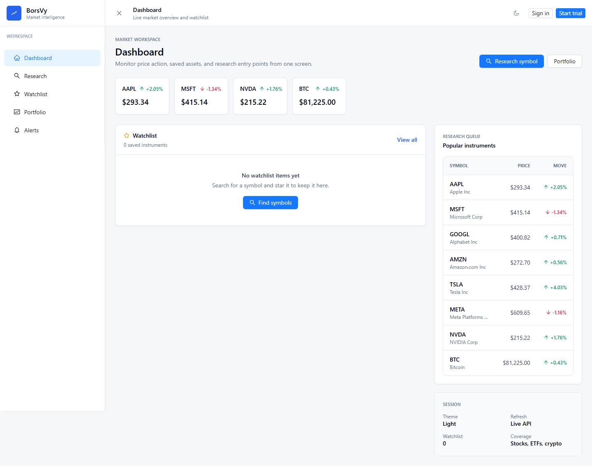
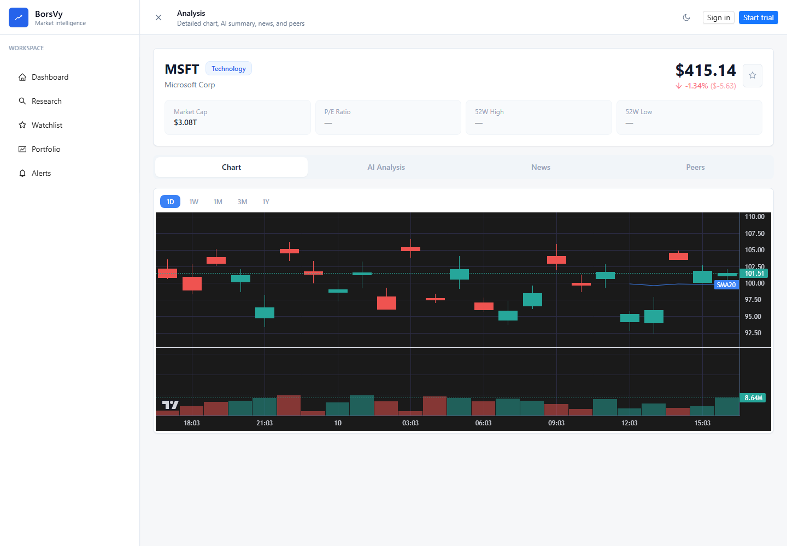
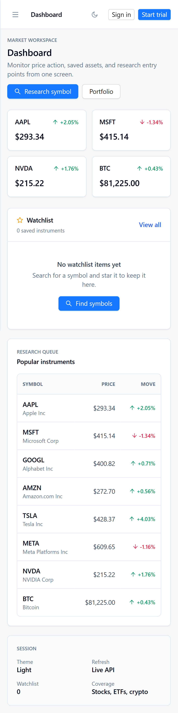
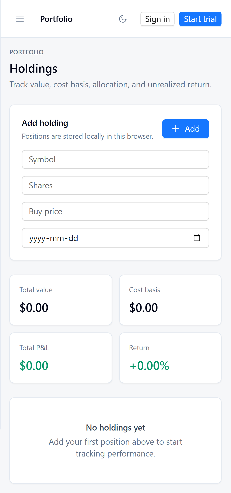
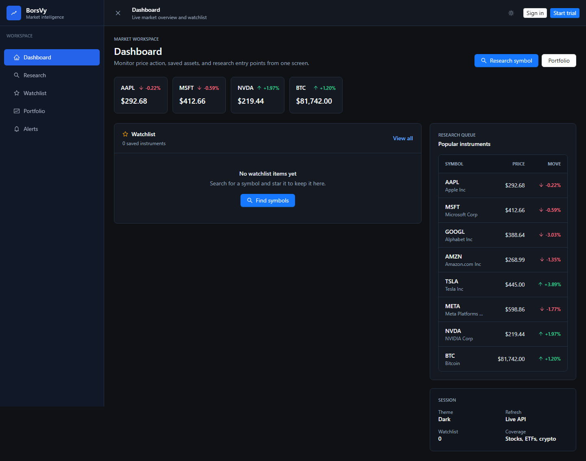
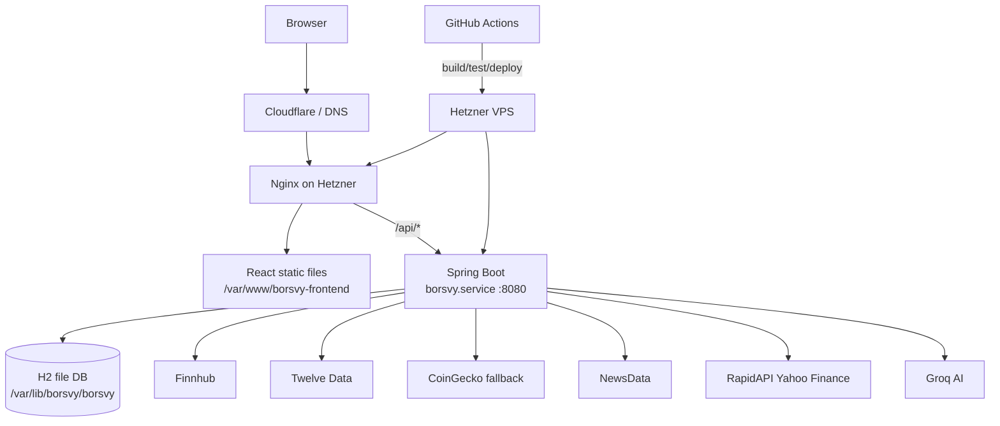

# BorsVy

[](https://github.com/AbaSheger/borsvy/actions/workflows/deploy-hetzner.yml)

BorsVy is a SaaS-style market intelligence app for stock and crypto research. It has a React/Vite frontend, a Spring Boot backend, GitHub Actions verification, and automated deployment to a Hetzner VPS behind Nginx and HTTPS.

Live site: https://borsvy.abenezeranglo.uk/

## Current Features

- Market dashboard with clickable overview cards.
- Popular instruments table for quick research entry.
- Watchlist/favorites with mobile-specific card layout.
- Stock and crypto analysis pages.
- Lazy-loaded AI analysis and news panels.
- Portfolio holdings stored through the backend with local fallback behavior.
- Price alerts stored through the backend with local fallback behavior.
- Authentication endpoints for email/password and Google sign-in support.
- Light and dark theme with mobile e2e coverage.
- Responsive layout tested on desktop and mobile Chrome.
- Automated GitHub Actions deploy to Hetzner.

## Tech Stack

Frontend:
- React 18
- Vite
- Ant Design
- Tailwind CSS
- React Router
- Chart.js, Recharts, lightweight-charts
- Playwright and Vitest

Backend:
- Java 17
- Spring Boot 3.2.3
- Spring Web, Security, Data JPA, Validation, Actuator
- H2 by default for the single-VPS deployment
- Optional PostgreSQL via production environment overrides
- Flyway migrations are present but disabled by default in the current single-VPS H2 setup

External data and AI providers:
- Finnhub for stock quotes/company data
- Twelve Data for historical data and crypto quotes when configured
- CoinGecko fallback for crypto quotes when Twelve Data is not configured
- NewsData for news when configured
- RapidAPI Yahoo Finance fallback for news
- Groq for AI analysis when configured

## Screenshots

Desktop dashboard:



Desktop analysis workspace:



Mobile dashboard:



Mobile portfolio:



Dark-mode dashboard:



## Portfolio Case Study

This project was built as a production-style full-stack portfolio project rather than a regulated investment product. The goal was to demonstrate end-to-end product engineering: a usable React SaaS interface, a Java backend, third-party API integration, mobile quality checks, CI/CD, and a real VPS deployment.

Key engineering decisions:
- **Same-origin production API:** The frontend calls `/api/...` in production and Nginx proxies requests to Spring Boot. This avoids browser CORS complexity in production.
- **Lazy analysis loading:** Expensive AI and news requests are loaded only when the user opens those tabs, reducing initial dashboard latency and API cost.
- **Provider fallbacks:** Crypto quotes can fall back to CoinGecko when Twelve Data is not configured. News can fall back to RapidAPI when NewsData is unavailable.
- **Mobile-first verification:** Playwright runs both desktop and mobile projects, including route overflow checks, mobile table clipping checks, and theme-toggle checks.
- **Simple VPS deployment:** GitHub Actions builds/tests the app, uploads the frontend artifact, builds the backend jar on Hetzner, restarts systemd, and reloads Nginx.

Important product boundary:
- BorsVy is framed as market information and company/news briefing software. It is not intended to provide investment, financial, tax, or legal advice.

## Current Architecture


```mermaid
flowchart TD
    User[Browser] --> Cloudflare[Cloudflare / DNS]
    Cloudflare --> Nginx[Nginx on Hetzner]
    Nginx --> Frontend[React static files<br/>/var/www/borsvy-frontend]
    Nginx -->|/api/*| Backend[Spring Boot<br/>borsvy.service :8080]

    Backend --> DB[(H2 file DB<br/>/var/lib/borsvy/borsvy)]
    Backend --> Finnhub[Finnhub]
    Backend --> TwelveData[Twelve Data]
    Backend --> CoinGecko[CoinGecko fallback]
    Backend --> NewsData[NewsData]
    Backend --> RapidAPI[RapidAPI Yahoo Finance]
    Backend --> Groq[Groq AI]

    GitHub[GitHub Actions] -->|build/test/deploy| Hetzner[Hetzner VPS]
    Hetzner --> Nginx
    Hetzner --> Backend
```

The diagram reflects the current single-VPS production setup. The app can be moved to PostgreSQL later, but production currently defaults to file-based H2 unless environment variables override it.

## Repository Layout

```text
.
|-- .github/workflows/deploy-hetzner.yml
|-- backend
|   |-- .env.example
|   |-- pom.xml
|   |-- mvnw / mvnw.cmd
|   `-- src/main
|       |-- java/com/borsvy
|       |   |-- client
|       |   |-- controller
|       |   |-- model
|       |   |-- repository
|       |   |-- security
|       |   `-- service
|       `-- resources
|           |-- application.properties
|           |-- application-prod.properties
|           `-- db/migration
|-- frontend
|   |-- .env.example
|   |-- package.json
|   |-- playwright.config.js
|   |-- src
|   `-- tests/e2e
|-- screenshots
`-- README.md
```

## Local Development

Requirements:
- Node.js 18
- Java 17
- Maven wrapper from the repo

Start the backend:

```bash
cd backend
cp .env.example .env
./mvnw spring-boot:run
```

On Windows PowerShell:

```powershell
cd backend
Copy-Item .env.example .env
.\mvnw.cmd spring-boot:run
```

Start the frontend:

```bash
cd frontend
npm ci
cp .env.example .env.local
npm run dev
```

Frontend dev server:

```text
http://localhost:3001
```

Backend API:

```text
http://localhost:8080
```

The frontend uses `http://localhost:8080` as the API base URL in dev. In production it uses same-origin `/api/...` behind Nginx.

## Environment Variables

The backend can boot with safe defaults, but real market/news/AI functionality depends on API keys.

Common backend variables:

```text
FINNHUB_API_KEY
TWELVEDATA_API_KEY
TWELVEDATA_API_URL
NEWSDATA_API_KEY
NEWSDATA_API_URL
RAPIDAPI_API_KEY
RAPIDAPI_API_HOST
GROQ_API_KEY
JWT_SECRET
MAIL_HOST
MAIL_PORT
MAIL_USERNAME
MAIL_PASSWORD
STRIPE_SECRET_KEY
STRIPE_WEBHOOK_SECRET
STRIPE_PRO_PRICE_ID
ALLOWED_ORIGINS
```

Database overrides for PostgreSQL:

```text
DATABASE_URL
DB_DRIVER
DB_DIALECT
DB_USERNAME
DB_PASSWORD
JPA_DDL_AUTO
FLYWAY_ENABLED
```

Current production defaults in `application-prod.properties` use file-based H2:

```text
jdbc:h2:file:/var/lib/borsvy/borsvy
```

That is acceptable for the current small single-server deployment. For heavier use, move to PostgreSQL and enable migrations deliberately.

Frontend production variable:

```text
VITE_API_URL
```

For the Hetzner/Nginx deployment this is usually left empty so the frontend calls same-origin `/api/...`.

## Backend API Surface

Main routes include:

```text
GET  /api/health

GET  /api/stocks/market-overview
GET  /api/stocks/{symbol}
GET  /api/stocks/search?query=...

GET  /api/analysis/{symbol}/price-history
GET  /api/analysis/{symbol}/ai
GET  /api/analysis/{symbol}/news?limit=5

GET  /api/favorites
POST /api/favorites
DELETE /api/favorites/{symbol}

GET  /api/portfolio/holdings
POST /api/portfolio/holdings
DELETE /api/portfolio/holdings/{id}

GET  /api/alerts
POST /api/alerts
PATCH /api/alerts/{id}/toggle
PATCH /api/alerts/{id}/triggered
DELETE /api/alerts/{id}

GET  /api/auth/me
POST /api/auth/login
POST /api/auth/register
POST /api/auth/google
POST /api/auth/logout
```

`GET /api/auth/me` returns `401` when the visitor is logged out. That is expected behavior.

`GET /api/health` returns a lightweight status payload for deployment checks and uptime monitoring.

## Testing

Frontend unit tests:

```bash
cd frontend
npm test
```

Playwright e2e tests:

```bash
cd frontend
npm run test:e2e
```

The Playwright suite runs:
- Desktop Chrome journey tests.
- Mobile Chrome journey tests.
- Mobile no-horizontal-overflow checks.
- Mobile dashboard table clipping checks.
- Mobile theme toggle checks.

Frontend production build:

```bash
cd frontend
npm run build
```

Backend compile:

```bash
cd backend
./mvnw -q -DskipTests compile
```

Backend package:

```bash
cd backend
./mvnw clean package -DskipTests
```

## Deployment

Production is currently deployed to a Hetzner VPS:

```text
Frontend static root: /var/www/borsvy-frontend
Repo checkout:         /var/www/borsvy
Backend jar path:      /root/backend-0.0.1-SNAPSHOT.jar
Backend service:       borsvy.service
Backend port:          8080
Nginx API proxy:       /api/ -> http://localhost:8080/api/
```

Nginx serves the frontend and proxies API requests to the Spring Boot service.

Operational work covered by this project includes:

- GitHub Actions deployment to a single Hetzner VPS.
- systemd-managed Spring Boot backend runtime.
- Nginx static frontend hosting and API reverse proxying.
- Production secret rotation workflow for third-party API credentials.
- Health-check based backend restart verification.
- A documented secret-rotation runbook for repeatable production maintenance.

Useful server commands:

```bash
systemctl status borsvy.service --no-pager
journalctl -u borsvy.service -n 120 --no-pager
nginx -t
systemctl reload nginx
```

### Production Secret Rotation Runbook

Production backend secrets are currently loaded from:

```text
/root/application-prod.properties
```

The systemd service starts the backend through:

```text
/root/start-borsvy.sh
```

and passes:

```text
--spring.config.additional-location=file:/root/application-prod.properties
```

When an API key or auth secret is exposed, treat it as compromised even if it has since been removed from the current branch. Git history, build logs, screenshots, or copied terminal output may still contain the old value.

Rotate the affected provider keys in the provider dashboards first, then update the Hetzner file:

```bash
sudo nano /root/application-prod.properties
```

Expected production properties include:

```properties
finnhub.api.key=...
serpapi.api.key=...
polygon.api.key=...
rapidapi.api.key=...
rapidapi.api.host=finance-news22.p.rapidapi.com
groq.api.key=...
groq.model.id=llama-3.3-70b-versatile
allowed.origins=*
jwt.secret=...
```

Generate a new JWT signing secret when rotating auth:

```bash
openssl rand -base64 48
```

`jwt.secret` must be a single line. If the value wraps onto a second standalone line, delete both JWT lines and paste a freshly generated value as one line:

```properties
jwt.secret=single-line-secret-value
```

In nano:

```text
Ctrl+O  save
Enter   confirm filename
Ctrl+X  exit
```

Restart and verify:

```bash
sudo systemctl restart borsvy.service
sudo systemctl status borsvy.service --no-pager
curl -fsS http://127.0.0.1:8080/api/health
```

Use this command to confirm secret fields exist without printing values:

```bash
sudo awk -F= '
BEGIN { IGNORECASE=1 }
$1 ~ /(api\.key|secret|password|token)/ { print $1"=<redacted>"; next }
{ print }
' /root/application-prod.properties
```

The output should include `jwt.secret=<redacted>` and should not include any random-looking standalone line after it.

After production is healthy, revoke or delete the old exposed keys in each provider dashboard. For this project, check:

```text
Finnhub
SerpAPI
Polygon
RapidAPI
Groq
```

## GitHub Actions Deploy

The deploy workflow is `.github/workflows/deploy-hetzner.yml`.

It runs on every push to `main` and can also be started manually from GitHub Actions.

Verify job:
- Checks out the repo.
- Installs frontend dependencies.
- Installs Playwright Chromium.
- Builds the frontend.
- Runs Playwright e2e tests.
- Uploads the frontend `dist` artifact.
- Sets up Java 17.
- Compiles the backend.

Deploy job:
- Downloads the frontend artifact.
- Uploads it to the VPS.
- Pulls/resets the repo under `/var/www/borsvy`.
- Builds the backend jar on the VPS.
- Copies the jar to `/root/backend-0.0.1-SNAPSHOT.jar`.
- Restarts `borsvy.service`.
- Waits for `/api/health` before continuing.
- Syncs frontend files to `/var/www/borsvy-frontend`.
- Validates and reloads Nginx.

Required GitHub repository secrets:

```text
HETZNER_HOST
HETZNER_USER
HETZNER_SSH_KEY
HETZNER_SSH_PORT
```

Current values are expected to be:

```text
HETZNER_HOST=37.27.31.97
HETZNER_USER=root
HETZNER_SSH_PORT=22
```

Do not commit the private SSH key. Store it only in GitHub Secrets.

Optional GitHub repository variables:

```text
HETZNER_APP_DIR
HETZNER_FRONTEND_DIR
HETZNER_BACKEND_SERVICE
HETZNER_BRANCH
```

Defaults:

```text
HETZNER_APP_DIR=/var/www/borsvy
HETZNER_FRONTEND_DIR=/var/www/borsvy-frontend
HETZNER_BACKEND_SERVICE=borsvy.service
HETZNER_BRANCH=main
```

## Current Production Notes

- Cloudflare may cache old frontend assets. Purge Cloudflare cache if the deployed UI appears stale.
- The backend may return `401` for `/api/auth/me` when logged out; that is normal.
- Java startup takes roughly 10-15 seconds on the current VPS. The deploy workflow waits for `/api/health` after restart.
- The app currently uses H2 storage by default in production. Use PostgreSQL before expecting multi-user durability at scale.
- Some browser console messages such as `A listener indicated an asynchronous response...` can come from browser extensions. Incognito testing confirmed this is not from the app.

## Known Limitations

- This is a portfolio project, not a regulated financial-advice product.
- Market data depends on third-party providers and may be delayed, unavailable, or rate-limited.
- Free/personal API plans may not be appropriate for a commercial SaaS launch.
- H2 is the default production database for this prototype; PostgreSQL is recommended for real users.
- The deploy currently restarts the backend in place, so brief API downtime can happen during deployment.
- AI summaries should be treated as informational summaries, not trading recommendations.

## Scalability Notes

This is suitable for a small SaaS prototype on a single VPS. Before serious production usage:

- Move from H2 to PostgreSQL.
- Put backend secrets in a systemd environment file or a secrets manager.
- Reduce restart downtime further with blue/green or rolling deploys.
- Add caching/rate limiting around external market data APIs.
- Add structured logging and monitoring.
- Add database backups.
- Avoid root SSH deployment long term; use a restricted deploy user.
- Split frontend and backend deployment steps if deploy downtime becomes visible.

## License

MIT
